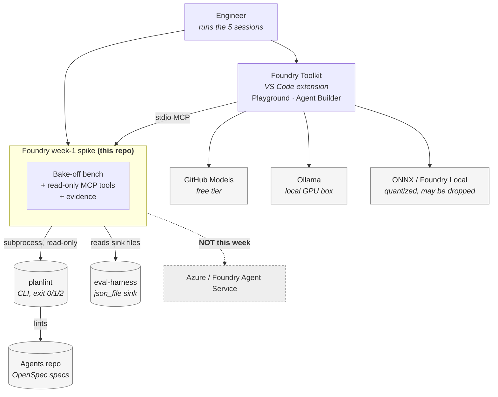
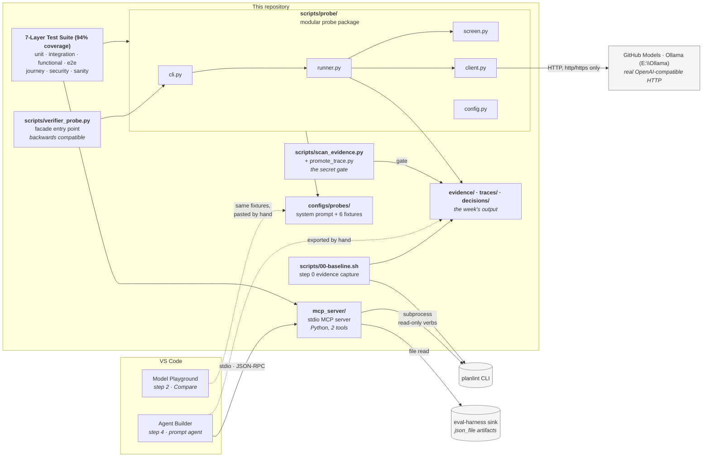
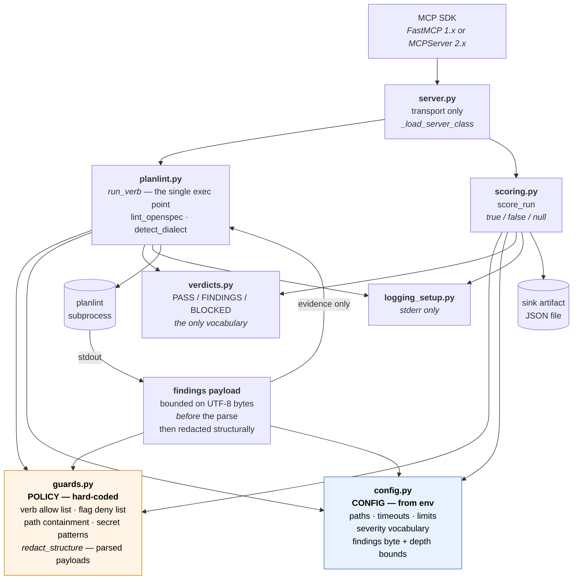
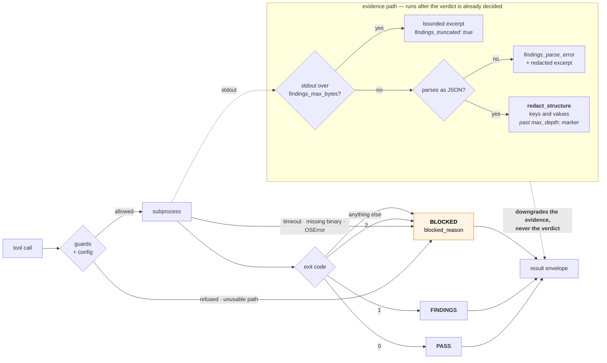
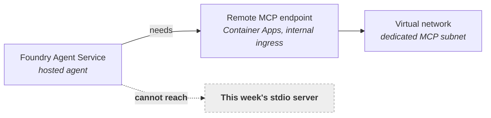

# Architecture — C4 view

Three levels, because the fourth (code) is the source and would go stale.
Everything below describes **week 1 only**: local, stdio, zero Azure spend.
The week-2 shape is at the bottom, drawn separately, because the difference
between the two is the whole point of the spike's verdict.

---

## C1 — System context

Who touches the spike, and what stays outside it.

**Read the arrows for direction of trust.** Everything flows *out* of the
spike: it reads `planlint` and the harness sink and never writes to either. No
commits reach `Mango_Code_Agent-Harness`, `Agents` or `planlint` this week, and
`mcp_server/tests/test_seam_is_closed.py` fails if the wrapper starts importing
what it should be calling.

---

## C2 — Containers

The runnable pieces and what each one is for.

**Why the probe exists alongside the Playground.** The runbook calls the
verifier cell the week's most important signal and then measures it by reading
a GUI. The decomposed probe (`scripts/probe/`) sends the same system prompt and
fixture over HTTP to real local Ollama models (`E:\Ollama\ollama.exe`) or GitHub
Models and saves every transcript with a deterministic regex-based screen (`screen.py`),
so that one cell is reproducible.
It does not replace the Playground: only the Playground gives the local
resource profile for slots C and D.

### 7-Layer Test Architecture (Quality & Safety Gates)

The spike implements a rigorous enterprise 7-layer automated testing gate enforcing >=80% branch coverage (currently 94%):

1. **Unit Layer (`tests/unit/`, `mcp_server/tests/`)**: Pinned contract validation, modular probe config/screening unit checks, scoring branch coverage.
2. **Integration Layer (`tests/integration/`)**: Direct tool-function calls integrated with filesystem artifacts and the probe pipeline.
3. **Functional Layer (`tests/functional/`)**: `planlint` exit code mapping to tri-state verdicts (`PASS` 0, `FINDINGS` 1, `BLOCKED` 2/precondition).
4. **End-to-End Layer (`tests/e2e/`)**: Subprocess execution of `scan_evidence.py`, `promote_trace.py`, and `verifier_probe.py`.
5. **User Journey Layer (`tests/journey/`)**: Full developer evaluation lifecycle simulation from OpenSpec authoring to trace promotion.
6. **Security Layer (`tests/security/`)**: Fuzzing path traversal attacks, command-line flag injection, mutating verbs denial, and secret redaction.
7. **Sanity Layer (`tests/sanity/`)**: Enterprise environment health, PEP 561 markers, CLI entrypoints, and dependency validation.

---

## C3 — Components inside `mcp_server/`

### The two rules this diagram encodes

**Policy and configuration are different things.** `config.py` reads the
environment — where planlint lives, how long to wait, which severity words this
build knows. `guards.py` reads nothing: the verb allow list, the flag deny list
and the credential patterns are hard-coded, because an allow list that can be
widened with an environment variable is not an allow list. Changing what the
tool may execute should require a code change, a review and a test.

**`server.py` holds no behaviour.** The tool modules import nothing from the
SDK, which is what lets the contract suite run with no dependency installed at
all. The cost of that separation, learned the hard way: nothing imported
`server.py` either, so it shipped against an SDK entry point that no longer
existed. CI now runs the transport as its own job.

### Verdict flow

Every arrow into BLOCKED is a place an exception would otherwise have escaped.
That is the contract in one picture: **an exception is not a verdict**, and
there is no path from any failure to PASS.

The other half of the picture is an arrow that is not there. Nothing in the
evidence lane points back at the exit-code decision. A payload too large to hand
back, one that does not parse, or one a credential had to be redacted out of
arrives in the envelope degraded and says so — `findings_truncated`,
`findings_parse_error`, a depth marker — and leaves the verdict exactly where
the exit code put it. Exit 1 with an unreadable 30 MB payload is still FINDINGS.

---

## Week 2, if the verdict says proceed

Drawn to make the gap explicit, because the diagram is the argument.

A hosted agent consumes **remote** MCP endpoints; Tool Catalog's local servers
are for use inside VS Code. None of the transport built this week carries over.
The **tool contract** does, and it is the part worth carrying — which is why
the contract, not the server, is what the test suite defends.

Cost and identity work for that step is enumerated in
`evidence/05-verdict.template.md` section 6, and is gated on the step 5 verdict.
